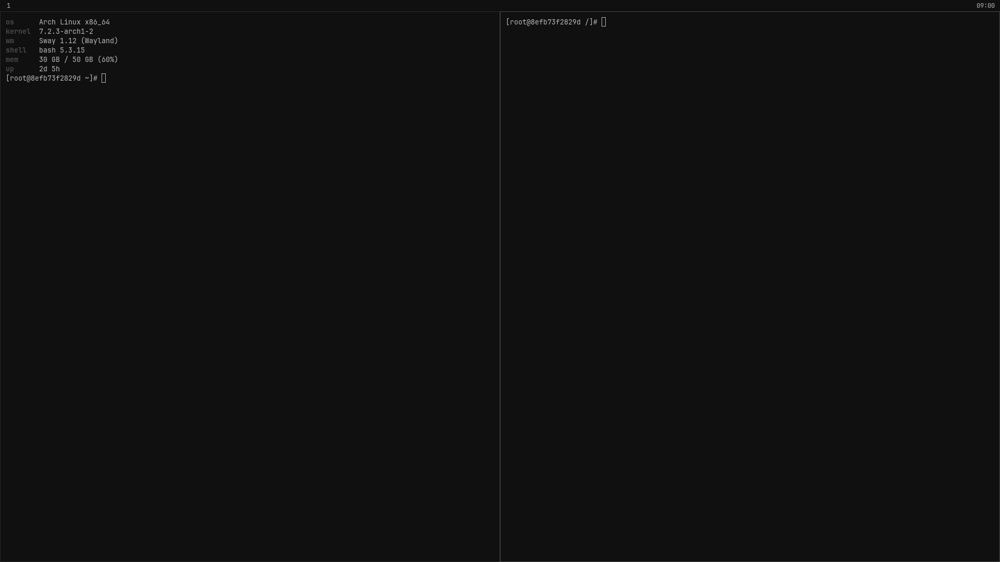

# intentionally boring rice

a desktop built so that nothing on it ever asks for
your attention.

```
bash <(curl -s https://raw.githubusercontent.com/ItsTesy/intentionally-boring-rice/main/ibr.sh)
```



Most rices are made to be looked at. Wobbly windows, a blurred terminal you
can read your wallpaper through, a bar with a CPU graph that you end up
watching instead of working, notifications sliding in from the corner to say a
download finished. It's fun for a weekend. Then it quietly costs you twenty
minutes a day forever.

This is the other thing. Flat black root window, one pixel borders, no
animations, no blur, no rounded corners, no shadows, no tray, no window
titles, no wallpaper at all. The bar has a clock and your workspace numbers
unless you ask it for more. Everything on screen is grey except a critical
battery warning, which is the one red thing in the whole setup, because that
one is information and not decoration.

I don't daily this. I run something prettier with a lot more going on. But
when somebody asks me for a tiling setup that stays out of the way, this is
what I want to hand them instead of a dotfiles repo and four hours of my
evening.

## what it asks you

Nine rows, on one screen, with the impossible ones greyed out and a reason
next to them rather than just missing:

| row | options |
|---|---|
| os | 19 of them, across 15 package managers |
| aur | arch and artix only, off by default |
| wm | 16, from sway to xmonad |
| bar | waybar, yambar, polybar, tint2, or none |
| items | workspaces, time, date, volume, battery, and which end they sit at |
| launcher | fuzzel, tofi, wofi, bemenu, rofi, dmenu, or none |
| terminal | foot, alacritty, kitty, st, xterm |
| notifs | dunst, mako, swaync, or none |
| fastfetch | print it when a terminal opens, or don't |

Pick an x11 wm and the wayland-only bars drop behind a "wayland only". Pick
netbsd and most of the wm list greys out with "not in your repos", because
pkgsrc has sway and almost nothing else and pretending otherwise just wastes
your time. Turn aur on and swayfx, dwl, dwm, st, yambar and tofi become
selectable; the row isn't there at all on the seventeen systems that have
never heard of it.

The bar's items live in a third pane on the bar row, listed under left, center
and right in the order they'll be drawn. Enter puts one in or takes it out,
shift and an arrow nudges it, and pushing it past a heading is what moves it
to the other end.

Keybinds are the i3 and sway set, because that's what most people already have
in their fingers. Mod+Return for a terminal, Mod+d for the launcher,
Mod+Shift+q to close, Mod+1 through 9 for workspaces, Print to copy a region.
The same chords everywhere, with three honest exceptions. A stacking wm like
openbox or icewm has no directional focus to give you, so hjkl walk the stack
there. dwl and dwm are compiled in and cannot reload, so Mod+Shift+c does
nothing on those two. And a master-and-stack tiler has no window to the left
of another, so on dwm and dwl Mod+h and Mod+l move between monitors, which
does nothing at all on a laptop with one screen.

## it will overwrite your configs

Anything ibr is about to touch gets moved into
`~/.config/ibr-backup-<timestamp>/` first, with paths intact, and the exact
undo command is printed before a single file is written:

```
ibr restore 20260911-0900
```

ibr is not a dotfiles manager and doesn't want to be one. It writes a set of
configs once and then it's done. Edit them, break them, delete them. If you
re-run it you get a fresh backup and a fresh set of configs, nothing clever.

## why not curl | sh

Because `curl | sh` hands your terminal's stdin to the pipe, and the pipe is
full of the script itself. The first thing a `read` does is eat the next line
of the installer. Every installer that prompts you works around this somehow,
usually by opening `/dev/tty` behind your back. Process substitution just
doesn't have the problem: bash gets the script as a file argument and stdin
stays on your keyboard.

If you pipe it anyway, it won't hang, it'll tell you to use the other form.
`--yes` takes the defaults and needs no terminal at all.

## systems

The picker only offers packages that exist in repos that are on by default. No
copr, no obs home projects, no ppas, and no aur unless you turn it on. Every
name in `data/packages.tsv` came out of a real package index. ci re-queries
all of them on arch, debian, fedora and opensuse on every push, so the day one
gets renamed the build goes red instead of the installer going quiet.

pacman (arch, artix) · apt (debian) · dnf (fedora) · zypper (opensuse) · xbps
(void) · apk (alpine, chimera) · portage (gentoo) · nix (nixos) · guix · pkg
(freebsd, ghostbsd, dragonfly, hardenedbsd) · pkg_add (openbsd) · pkgin
(netbsd) · prt-get (crux) · kiss

The bsds get less than the linux side. freebsd has 48 of the 51 packages ibr
wants and runs wayland fine on Intel and AMD, though NVIDIA has no working
wayland path there at all. openbsd ports carries sway, niri, wayfire and
mango, which surprised me; netbsd has sway and then stops. crux and kiss build
everything from source and are missing most of the list, so they're in the
menu mostly so you can see what you'd be in for.

st keeps upstream's `config.def.h` layout with only the palette and the font
changed, so you can diff it against suckless and see exactly what ibr did.
dmenu has no config at all here, it takes its colours as flags. dwm, dwl and
mangowm get compiled where they are not packaged, because that is how they are
configured, and ibr ships a `config.h` for each. It checks the build headers
exist first and says so instead of dropping you in a make log: mangowm needs
scenefx, which is aur-only on arch, so arch says "not in your repos" rather
than trying. xmonad is never compiled. Configuring xmonad means recompiling
Haskell every time you want to move a keybind, and dragging two gigabytes of
GHC into an installer that's supposed to be boring is a joke that stops being
funny during the download. You get the distro package and the stock config.

## the no list

Not planned, not a TODO, won't be accepted as a PR:

- a wallpaper, or any way to set one
- window animations, blur, rounded corners, shadows, opacity
- a system tray
- a CPU, RAM, network or weather module
- media controls or album art
- an on-screen volume or brightness popup
- a greeter theme
- colours, beyond the greys and the one red

## what is tested

Three jobs run on every push, all in containers.

One walks all sixteen window managers on arch. The ones the package table says
arch can install have to install, write every config with no `@TERM@` style
placeholder left, and leave an autostart that is valid shell. The ones it says
arch cannot install, swayfx and mangowm, have to be refused, and the job fails
if one of those quietly succeeds instead. Turning the aur on gets you both,
but ci does not, because a ci run that builds from the aur tests the aur. One
runs every config through its own parser. sway, i3 and awesome each get
their own validate flag, foot and fuzzel check their own files, qtile's config
gets loaded rather than merely parsed, openbox goes through xmllint, and the
json, toml and yaml ones get read by a parser that will not accept a typo. One
re-queries every package name
in the table against four real package indexes.

The screenshot up there is generated. sway runs headless in a container with
these exact configs and screenshots itself, so it cannot drift from what the
repo ships.

None of it runs on real hardware, because a container has no screen. The bsds
are checked against their package catalogs and nothing else. The combination
in the screenshot is the one I would trust without sitting in it.

## license

MIT. Do what you want with it.
